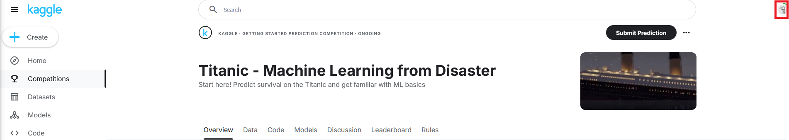
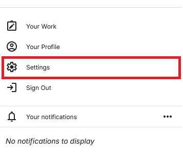
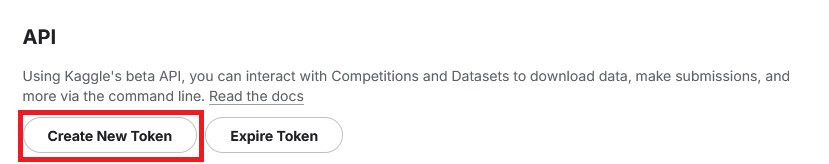
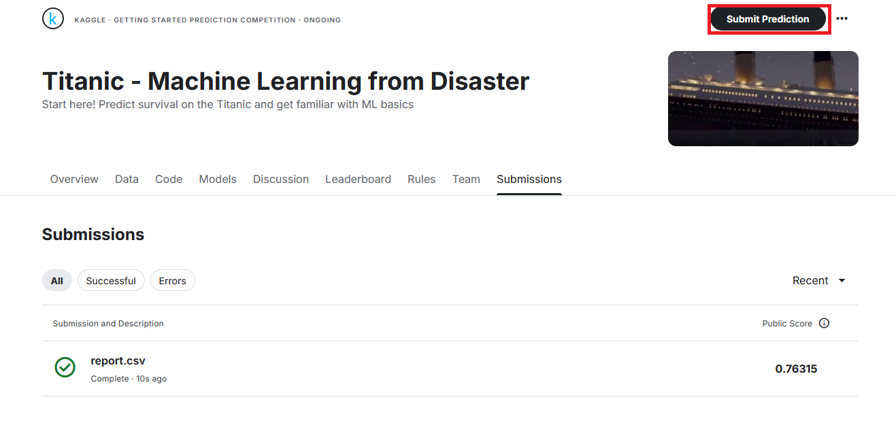

# Machine Learning CHAD Challenge

You have been tasked by historians to see if you could create a model that best predicts who surives on the titanic. You are given a dataset and your goal is to create a model that predicts who surives with the highest possible accuracy.

**IMPORTANT NOTE** Kaggle limits to 5 submissions per day so please use them wisely.

## Setting Up

You must have the following installed:
* git
* python3

First clone the repo:
```
git clone https://github.com/DSAccountQQQ/DSLesson.git
cd DSLesson
```

Create a python virtual env:
```
python -m venv venv

[Max/Linux]
source ./venv/bin/activate

[Windows]
.\venv\Scripts\activate
```

Install the python libraries:
```
pip install -r requirements.txt
```

### Installing Kaggle

We will be using [Kaggle's Titanic Challenge](https://www.kaggle.com/competitions/titanic) for this challenge. Create an account and download the kaggle.json for your account.

Click on your profile image in the top right corner of Kaggle




Go to the settings of your profile


Download your API Token in the API section of the settings



Move the `kaggle.json` from your Downloads folder to `~/.kaggle/` on Mac or Linux or `C:\Users\user\.kaggle` on Windows

### Downloading the Dataset

Install python libraries
```
pip install -r requirements.txt
```

Download the Dataset
```
kaggle competitions download -c titanic 
```

On Mac/Linux:
```
unzip titanic.zip
```

On Windows Poweshell
```
Expand-Archive titanic.zip
```

## Ready, Set, Go

Launch the jupyter notebook to start the challenge

```
jupyter notebook
```

Running all the code in this notebook should result in a `result.csv` file being generated. These are the predictions for kaggle.

### Uploading

You can upload this CSV via the website:



Or you can submit with the following:
```
kaggle competitions submit -c titanic -f report.csv -m "CHAD submission 1"
```

Once done please screenshot the accuracy and post it to the discord to be eligable for the CHAD award.

Best accuracy wins GIGACHAD and second best wins CHAD. 